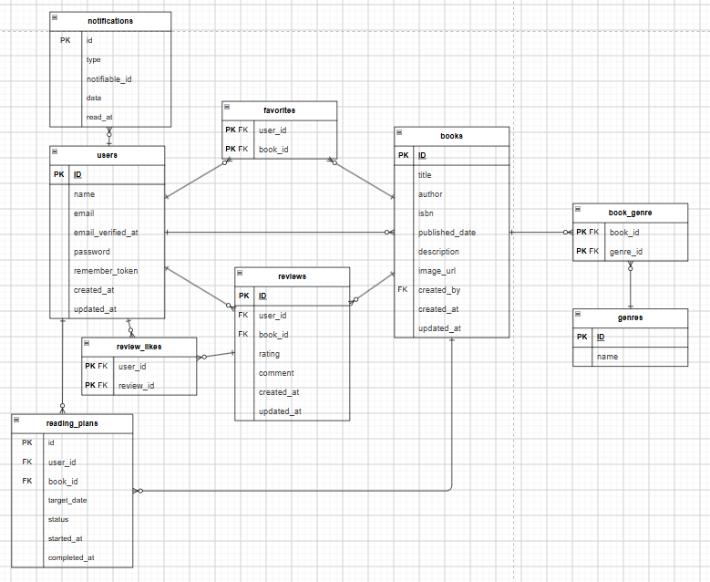

# BookShelf

## 主な機能

### 書籍管理

- 書籍一覧表示
- 書籍詳細表示
- 書籍登録
- 書籍編集
- 書籍削除
- キーワード検索
- ジャンル検索
- ISBN検索
- 書籍の並び替え

書籍一覧ページはゲストユーザーでも閲覧できます。

書籍の登録・編集・削除にはログインが必要です。

書籍の編集・削除についてはLaravel Policyによる認可処理を行っています。

---

### ISBN検索

ISBNを指定して書籍情報を検索できます。

```text
GET /books/isbn/{isbn}
```

外部APIから取得した書籍情報を利用して、書籍登録時の入力を補助します。

---

### ジャンル管理

- ジャンル一覧
- ジャンル詳細
- ジャンル登録
- ジャンル編集
- ジャンル削除
- 書籍とジャンルの紐付け

ジャンル機能はログインユーザーのみ利用できます。

---

### レビュー

書籍に対してレビューを投稿できます。

- レビュー投稿
- レビュー編集
- レビュー削除
- 1〜5段階評価
- レビューへの「いいね」

レビューの編集・削除には認可処理を使用しています。

---

### お気に入り

ログインユーザーは書籍をお気に入り登録できます。

- お気に入り登録・解除
- お気に入り一覧表示

登録・解除はトグル形式で処理しています。

---

### ランキング

レビュー評価をもとに書籍ランキングを表示します。

```text
GET /ranking
```

ランキングページはログインしていないユーザーも閲覧できます。

---

## 読書計画

ユーザーごとに書籍の読書計画を管理できます。

```text
GET    /reading-plans
GET    /reading-plans/create
POST   /reading-plans/create
GET    /reading-plans/{plan}/edit
PUT    /reading-plans/{plan}/update
POST   /reading-plans/{plan}/complete
DELETE /reading-plans/{plan}
```

主な管理情報：

- 書籍
- 読了予定日
- 読書状態
- 読書開始日時
- 読了日時

読書状態にはEnumを使用しています。

```text
reading   : 読書中
completed : 読了
```

---

## リマインダー通知

読書計画の期限に応じて、ユーザーへリマインダー通知を送信します。

LaravelのDatabase Notificationを使用しています。

実装クラス：

```text
app/Notifications/ReadingPlanReminderNotification.php
```

リマインダー処理はArtisan Commandとして実装しています。

```text
app/Console/Commands/SendReadingPlanReminders.php
```

コマンド：

```bash
php artisan reading-plans:send-reminders
```

Laravel Sailを使用する場合：

```bash
./vendor/bin/sail artisan reading-plans:send-reminders
```

通知一覧：

```text
GET /notifications
```

通知を既読にする：

```text
POST /notifications/{id}/read
```

---

## 読書レポート

ログインユーザー自身のレビュー・読書データを集計して表示します。

```text
GET /reports
```

主な集計内容：

- レビュー数
- 読了冊数
- 平均評価
- 評価分布
- 高評価書籍
- ジャンル別評価

---

# REST API

Laravel Sanctumを利用してAPI認証を実装しています。

APIのベースURL：

```text
/api/v1
```

---

## API認証

### ログイン

```http
POST /api/v1/login
```

ログイン成功時にSanctumのAPIトークンを発行します。

リクエスト例：

```json
{
    "email": "test@example.com",
    "password": "password"
}
```

認証が必要なAPIでは、取得したトークンをBearer Tokenとして送信します。

```http
Authorization: Bearer {token}
Accept: application/json
```

---

### ログアウト

```http
POST /api/v1/logout
```

認証が必要です。

現在利用しているSanctumトークンを削除します。

---

## 書籍API

| Method | Endpoint               | 内容         | 認証 |
| ------ | ---------------------- | ------------ | ---- |
| GET    | `/api/v1/books`        | 書籍一覧取得 | 不要 |
| GET    | `/api/v1/books/{book}` | 書籍詳細取得 | 不要 |
| POST   | `/api/v1/books`        | 書籍登録     | 必要 |
| PUT    | `/api/v1/books/{book}` | 書籍更新     | 必要 |
| DELETE | `/api/v1/books/{book}` | 書籍削除     | 必要 |

書籍更新・削除ではPolicyを利用し、対象書籍の作成者かどうかを確認します。

---

# 使用技術

## Backend

- PHP 8.1+
- Laravel 10
- Laravel Sanctum 3
- Laravel Fortify
- Eloquent ORM

## Frontend

- Blade
- Tailwind CSS 3
- Alpine.js
- Vite 5
- Axios

## Database

- MySQL 8.4

## Development

- Docker
- Laravel Sail
- phpMyAdmin
- PHPUnit
- Git
- GitHub
- Postman

---

# Docker構成

Laravel Sailを利用しています。

`compose.yaml`では以下のコンテナを使用しています。

| Service        | 内容          |
| -------------- | ------------- |
| `laravel.test` | Laravel / PHP |
| `mysql`        | MySQL 8.4     |
| `phpmyadmin`   | DB管理画面    |

Laravel：

```text
http://localhost
```

phpMyAdmin：

```text
http://localhost:8080
```

Vite：

```text
http://localhost:5173
```

---

# 環境構築

本プロジェクトは **Laravel Sail（Docker）** を使用して開発環境を構築します。

## 前提環境

以下がインストールされていることを確認してください。

- Git
- Docker / Docker Desktop
- WSL2（Windows環境の場合）
- PHP 8.1以上
- Composer
- Node.js
- npm

バージョンは以下のコマンドで確認できます。

```bash id="e1vb93"
git --version
docker --version
php -v
composer --version
node -v
npm -v
```

Composerがインストールされていない場合、Ubuntu / WSLでは以下でインストールできます。

```bash id="r7z5n1"
sudo apt update
sudo apt install composer
```

---

## 1. リポジトリをクローン

```bash id="p0m2f8"
git clone https://github.com/Naruyama628/BookShelf.git
```

プロジェクトディレクトリへ移動します。

```bash id="r6v8q4"
cd BookShelf
```

---

## 2. PHPパッケージをインストール

Composerを使用してLaravelに必要なパッケージをインストールします。

```bash id="g9c4t2"
composer install
```

正常に完了すると、プロジェクト内に `vendor` ディレクトリが作成されます。

```text id="mzq1b8"
BookShelf/
├── app/
├── vendor/
├── artisan
├── composer.json
├── compose.yaml
└── ...
```

---

## 3. `.env` を作成

`.env.example` をコピーします。

```bash id="k3x7s5"
cp .env.example .env
```

---

## 4. Laravel Sailを起動

Dockerコンテナをバックグラウンドで起動します。

```bash id="d8h2n6"
./vendor/bin/sail up -d
```

起動状態を確認します。

```bash id="w5f9j3"
./vendor/bin/sail ps
```

本プロジェクトでは主に以下のコンテナを使用します。

```text id="b4y7c1"
laravel.test    Laravel / PHP
mysql           MySQL
phpmyadmin      phpMyAdmin
```

---

## 5. APP_KEYを生成

Laravelの暗号化などで使用するApplication Keyを生成します。

```bash id="u2k8p4"
./vendor/bin/sail artisan key:generate
```

---

## 6. データベースを構築

Migrationを実行します。

```bash id="a6e3r9"
./vendor/bin/sail artisan migrate
```

初期データも登録する場合は、

```bash id="f1t5v7"
./vendor/bin/sail artisan db:seed
```

データベースを一度初期化して、MigrationとSeederをまとめて実行する場合は、

```bash id="q9n4l2"
./vendor/bin/sail artisan migrate:fresh --seed
```

> `migrate:fresh` は既存テーブルをすべて削除してから再作成します。既存データも削除されるため注意してください。

---

## 7. フロントエンドパッケージをインストール

Node.jsの依存パッケージをインストールします。

```bash id="c7m2z8"
npm install
```

---

## 8. Viteを起動

開発用のViteサーバーを起動します。

```bash id="h4s9x1"
npm run dev
```

開発中は、このターミナルを起動したままにします。

---

## 9. アプリケーションへアクセス

ブラウザから以下へアクセスします。

```text id="y8d3k6"
http://localhost
```

phpMyAdmin：

```text id="j2f7r4"
http://localhost:8080
```

---

# 2回目以降の起動

初回の環境構築が完了している場合、毎回 `composer install` や `migrate` を実行する必要はありません。

Dockerを起動します。

```bash id="l5p1v9"
./vendor/bin/sail up -d
```

Viteを起動します。

```bash id="n3c8w2"
npm run dev
```

終了する場合：

```bash id="t7q4m6"
./vendor/bin/sail down
```

---

# テスト実行

Feature Test / Unit Testは以下で実行できます。

```bash id="v9e2s5"
./vendor/bin/sail artisan test
```

PHPUnitを直接実行する場合：

```bash id="x1k6d8"
./vendor/bin/sail php vendor/bin/phpunit
```

---

# 環境構築の流れ

```text id="f4r8n3"
git clone
    ↓
cd BookShelf
    ↓
composer install
    ↓
cp .env.example .env
    ↓
./vendor/bin/sail up -d
    ↓
./vendor/bin/sail artisan key:generate
    ↓
./vendor/bin/sail artisan migrate:fresh --seed
    ↓
npm install
    ↓
npm run dev
    ↓
http://localhost
```

## トラブルシューティング

### `composer: command not found`

```text id="k6z2p7"
Command 'composer' not found
```

Composerがインストールされていません。

Ubuntu / WSLの場合：

```bash id="b8m5q1"
sudo apt update
sudo apt install composer
```

インストール後に確認します。

```bash id="r3h7v9"
composer --version
```

その後、再度実行します。

```bash id="s1n4c8"
composer install
```

---

### `./vendor/bin/sail: No such file or directory`

`vendor` がまだ作成されていない可能性があります。

```bash id="p9d2f5"
composer install
```

を先に実行してください。

---

### Dockerが起動しない

Docker Desktopが起動していることを確認した上で、

```bash id="w7k3m1"
docker --version
docker ps
```

を確認してください。

---

### データベースを最初から作り直したい

```bash id="e5v8q2"
./vendor/bin/sail artisan migrate:fresh --seed
```

を実行します

# ER図


